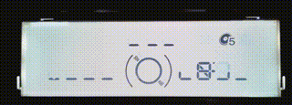
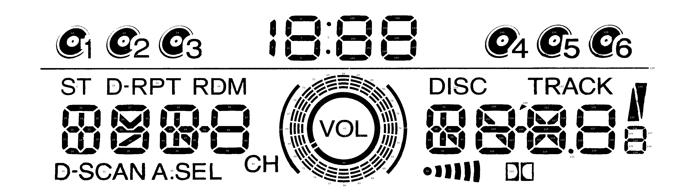

# Sanyo LC75883 Experiment
A ~2007 Honda Accord features a dashboard with integrated audio CD player/
changer controls and HVAC (heating/ventilation/air conditioning) controls.
This repository contains an Arduino sketch that allows it to control what
is shown on the CD player status LCD and read most of audio control buttons
presses.

HVAC portions of the control panel were ignored.

The CD player status LCD is driven by a Sanyo LC75883 LCD driver chip, which
communicates via a Sanyo's proprietary CCB protocol. CCB was also used by
a similar Sanyo LC75853 chip at the heart of my 
[Toyota tape deck faceplate](https://github.com/Roger-random/Sanyo_LC75853N)
project.

All details of this exploration are documented on https://newscrewdriver.com
tagged with "[Honda CD](https://newscrewdriver.com/tag/honda-cd/)".

By default this sketch runs a "spinner" animation in a loop.

Segment map of this LCD:

